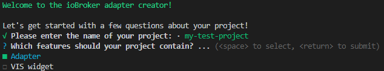

# &nbsp;<span style="vertical-align: middle">ioBroker adapter creator</span>

Command line utility to quickly create a new adapter or VIS widget for [ioBroker](https://github.com/ioBroker):



[


](https://www.npmjs.com/package/@iobroker/create-adapter)


[

](CHANGELOG.md)

## Prerequisites

Any computer with Node.js in version 18 or higher and npm 9 or higher. Note that the created adapters or ioBroker itself may have different requirements.

## Usage

This tool is not supposed to be installed. Instead, run the most recent version using

```
npx @iobroker/create-adapter@latest [options]
```

in the directory where the directory of your project should be created. You don't need to create the adapter/widget directory, because it will be created for you.
**WARNING:** If the path contains a space, this [won't work](https://github.com/npm/npx/issues/14).

After a short while, you will be asked a few questions. Afterwards all the necessary files will be created for you.

### Options

The following CLI options are available:

-   `--target=/path/to/dir` - Specify which directory the adapter files should be created in (instead of the current dir). Shortcut: `-t`
-   `--skipAdapterExistenceCheck` - Don't check if an adapter with the same name already exists on `npm`. Shortcut: `-x`
-   `--replay=/path/to/file` - Re-run the adapter creator with the answers of a previous run (the given file needs to be the `.create-adapter.json` in the root of the previously generated directory). Shortcut: `-r`
-   `--migrate=/path/to/dir` - Run the adapter creator with the answers pre-filled from an existing adapter directory (the given path needs to point to the adapter base directory where `io-package.json` is found). Shortcut: `-m`
-   `--nonInteractive` - Enable non-interactive mode. When used with `--replay`, missing answers will use their default values instead of prompting the user. Useful for automated regeneration. Shortcut: `-y`
-   `--noInstall` - Don't install dependencies after creating the files. Shortcut: `-n`
-   `--ignoreOutdatedVersion` - Skip the check if this version is outdated (not recommended). The version check is automatically skipped in CI environments.

All CLI options can also be [provided as environment variables](https://yargs.js.org/docs/#api-reference-envprefix) by prepending `CREATE_ADAPTER_`. Example: `CREATE_ADAPTER_TARGET=/tmp/iobroker/create-adapter/`

### Environment variables

Besides all environment variables mentioned above under "Options" the following variables change the behavior of the application:

-   `GOOGLE_APPLICATION_CREDENTIALS` - if this is pointing to a valid JSON file, the Google API v3 will be used for translations, make sure that the credentials are allowed to use the Google Translation API. Check [the documentation](https://cloud.google.com/translate/docs/setup) for more details.

## Features

-   Choose between: ioBroker adapter, VIS widget or both
-   Ask for package metadata (with automatic translation):
    -   Title (mandatory)
    -   Short description (optional)
    -   Adapter start mode
    -   Adapter/VIS category
    -   Keywords (optional)
-   IntelliSense (auto completion and tooltips) in supporting editors based on the [ioBroker declaration files](https://www.npmjs.com/package/@types/iobroker)
-   JavaScript with the following optional tools:
    -   [ESLint](https://github.com/eslint/eslint) for code quality
    -   Type checking based on the ioBroker declarations, including strongly-typed `adapter.config` properties
-   Or TypeScript with the following optional tools:
    -   [ESLint](https://github.com/eslint/eslint) for code quality
    -   Automatic formatting with [Prettier](https://github.com/prettier/prettier/)
    -   [nyc](https://github.com/istanbuljs/nyc) for code coverage
    -   strongly-typed `adapter.config` properties
-   Choose between indentation: tabs or 4 spaces
-   Choose your preferred quote style
-   Integration in the ioBroker admin UI:
    -   Settings page
    -   An extra tab (optional)
    -   Custom datapoint-specific options (optional)
-   [React](https://reactjs.org/) as an alternative to plain HTML+CSS for the admin and extra tab UI, based on [`@iobroker/adapter-react`](https://github.com/ioBroker/adapter-react/)
-   Predefined settings page for the admin UI
-   Choice of an OpenSource license and automatic creation of the license file
-   Built-in component tests using `mocha`, `chai` (with `chai-as-promised`) and `sinon` (with `sinon-chai`) for:
    -   Correctly defined package files
    -   and your own tests...
-   Automated testing using Github Actions, including a script for semantic release of new versions

## Developing

First of all: **DO NOT** push changes to `master` directly! Just don't. Every change should be done through PRs, which have a template with a checklist to fill out.
This makes sure that `master` always works and every change is documented.

For developers of this package, there are a few things to know:

-   `npm run build` creates a fresh build and deletes old build files. This is necessary when template files are renamed or deleted, as the compiled files will still be there.
-   `npm run watch` keeps compiling incremental changes whenever you save a source file.
-   The directory `/templates` contains a bunch of templates, which are basically TypeScript files exporting a single method:
    -   This method accepts an object with the user's answers and returns a `string` or `Promise<string>` containing the output file.
    -   The last extension (`.ts`) is removed when creating the output file. Setting the `customPath` property of the template method allows you to override the output path of the file, either a constant or depending on the user's answers (function).
    -   The outputted files are automatically formatted to have the correct indentation and multiple empty lines are removed. If you don't want this, set `noReformat` to true.
-   Test your changes with `npm test` and/or write relevant tests. For a couple of representative combination of answers, baseline adapter directories are generated. If those baselines are changed as a result of your changes, please review if those changes are desired.
-   Migration testing is available via `npm run test:migration`. This test clones the ioBroker.example repository (which contains reference adapters created with the adapter creator) and verifies that they can be successfully recreated, built, and linted using the current version of the creator. This ensures backward compatibility with previously generated adapters.

## Publishing

Do not publish directly using `npm`. Instead create a new release with the release script `npm run release ...`. This creates a tag on github, performs a test run on Github Actions and after a successful build automatically publishes to npm.

You can semantically increase the version and publish it by using

```bash
npm run release [<releaseType> [<postfix>]] [-- --dry]
```

(preferably) or set a specific version by using

```bash
npm run release <version> [-- --dry]
```

The option `-- --dry` (don't forget the first pair of dashes) performs a dry run without updating files.
The available release types are:

-   `major`
-   `premajor`
-   `minor`
-   `preminor`
-   `patch`
-   `prepatch`
-   `prerelease`

and the `pre-...` versions allow you to append a postfix like `-beta`.
